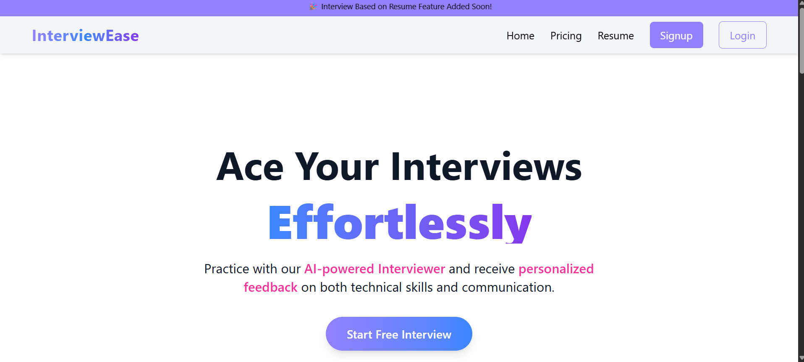

# InterviewEase Frontend 🎯  
**Effortlessly Prepare for Your Next Interview!**  


### 🏠 Home Page  

 

This is the **frontend application** of **InterviewEase**, built with React. It provides a clean and professional UI where users can simulate interviews, answer domain or resume-based questions, review responses, and get AI-powered feedback.  
 
👉 Frontend Repo: [InterviewEase Frontend](https://github.com/Yashpalsinghchouhan11/InterviewEaseFrontend)  

---

## 🚀 Features  

- **Authentication** – Secure login & signup with JWT.  
- **Category Page** – Choose domain-based or resume-based interview setup.  
- **Interview Flow** – Fetches one question at a time and supports answering via text/audio.  
- **Interview Report** – Displays AI feedback (confidence, strengths, weaknesses, improvement areas, and suggestions).  
- **Responsive Design** – Works seamlessly on desktop, tablet, and mobile.  
- **Toast Notifications** – Auto-hide success/error alerts.  
- **Error Boundaries** – Prevents app crashes with fallback UI.  
- **Protected Routes** – Prevents unauthorized access to interview routes.  

---

## 🛠️ Tech Stack  

- **Frontend Framework**: React (with React Router DOM)  
- **State Management**: Redux Toolkit + Redux Persist  
- **UI/Styling**: TailwindCSS + Material UI Icons  
- **Auth Handling**: JWT (with cookies)  

---

## 📂 Project Structure  

interviewease/
│── src/
  ├── assets
│ ├── components
    ├── layout
    ├── sections
    ├── ui
    ├── others
│ ├── features
│ ├── pages
  ├── store
│ ├── App.js 
│ └── index.js
│
├── package.json
├── tailwind.config.js
└── README.md


---

## ⚡ Installation & Setup  

1. **Clone the repository**  
   ```bash
   git clone https://github.com/Yashpalsinghchouhan11/InterviewEaseFrontend.git
   cd interviewease
   npm install
   npm run dev

## .ENV SETUP

    VITE_BASE_URL = "YOUR DOMAIN URL"
